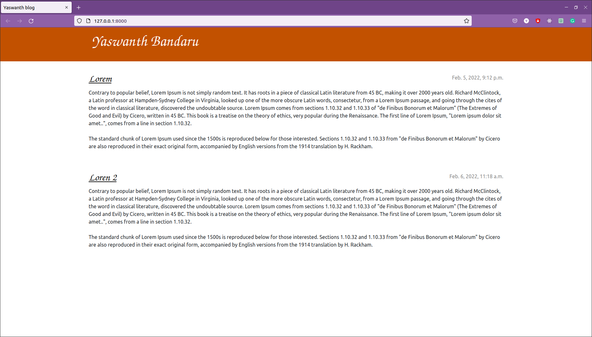

# Bandaru Yaswanth

To install environment

Create a virtual enviroment

	python3 -m venv {environment_name}

Install dependencies

	python3 -m pip install -r requirements.txt

requirements.txt is available at /mysite/ directory

Get into mysite directory run the server using following command

	python3 manage.py runserver

